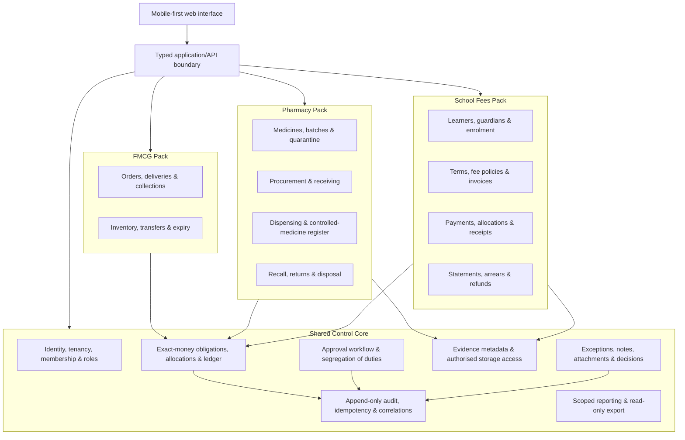

# Control Ledger Multi-Industry Extension Blueprint

**Author:** Manus AI  
**Date:** 27 August 2026  
**Purpose:** Define a practical route for operating Control Ledger as one shared control platform for FMCG distribution, pharmacy operations, and school fee collection without blending their different operational and regulatory responsibilities.

## Executive position

Control Ledger should remain a **control and financial-evidence platform**, not become one undifferentiated application. The existing foundation already maps strongly to FMCG: organisation and branch scope, controlled parties and obligations, payment/evidence capture, reconciliation, stock movement, immutable journals, exception workflows, independent approvals, audit history, and read-only exports.

For pharmacy, the system needs a dedicated **pharmacy operations pack** before it is suitable for dispensing or regulated medicine handling. For schools, it needs a dedicated **school fees pack** before it is suitable for end-to-end billing, allocation, parent communication, refunds, and debtor management. Both packs should use the same tenancy, access, money, evidence, approval, storage, and audit services rather than duplicate them.

> **Scope boundary.** This document is an implementation blueprint, not legal, clinical, accounting, or regulatory certification. Pharmacy configuration and go-live must be reviewed by a Nigeria-licensed pharmacist, the relevant pharmacy regulator, and a data-protection professional. School data governance should similarly be confirmed by the institution’s privacy and safeguarding leads.

| Industry | Current position | Appropriate operating boundary now | What makes it complete |
| --- | --- | --- | --- |
| FMCG distribution | Strongest fit | Distribution finance, collection, evidence, inventory, variance, ledger, and approval controls | Remaining real-device acceptance and provider-managed storage remediation gates |
| Pharmacy | Control foundation only | Non-clinical stock, branch, procurement, cash, and finance controls | Pharmacy master data, dispensing, controlled-drug handling, recall/quarantine, pharmacist governance, and clinical/privacy controls |
| School | Financial-control foundation only | Basic receivable and payment-evidence control | Learner/guardian/term context, fee policy and billing, allocation, receipts, credits/refunds, statements, parent communication, and school reports |

## 1. Pharmacy: modules required for operational readiness

The Pharmacy Council of Nigeria Act expressly addresses pharmacy premises, pharmacists and technicians, dangerous-drug records, and dispensing control. It also places regulation of storage, distribution, sale, and dispensing within the Council’s remit.[1] A pharmacy implementation must therefore separate **commercial control features** from **clinical and regulated workflow features**, and must not treat an AI suggestion or generic operator action as a dispensing decision.

| Pharmacy module | Key capabilities | Control design | Priority |
| --- | --- | --- | --- |
| Pharmacy organisation and professional governance | Pharmacy premise profile; superintendent pharmacist; pharmacist/technician identifiers and role assignments; licence/credential expiry reminders; branch operating status | Role privileges are time-bound, branch-scoped, audited, and cannot be self-approved | Must-have |
| Medicine and supplier master data | Generic/brand name; dosage form, strength, pack and unit conversions; manufacturer; supplier; approved taxonomy; barcode; storage condition; price history | Product records are versioned; price or catalogue changes require effective dates and audit events | Must-have |
| Batch, expiry, and storage control | Received batch/lot, expiry, quantity, location, cold-chain requirement, first-expiry-first-out pick proposal, stock count and adjustment workflow | Batch is mandatory for configured medicines; expired/quarantined stock cannot be selected for sale or dispensing | Must-have |
| Procurement and receiving | Purchase requisition, supplier order, goods-received note, invoice matching, batch capture, damage/shortage, supplier credit | Three-way evidence trail: order, receipt, supplier invoice; independent approval above a value threshold | Must-have |
| Sale and dispensing workspace | Patient/customer identity at the minimum necessary level; prescription/order capture; pharmacist review; dispense, partial dispense, substitution, counselling acknowledgement; receipt/invoice | A pharmacist-authorised action is distinct from cashier collection; no automatic clinical substitution or dispensing | Must-have for dispensing |
| Prescription and interaction safety integration | Structured prescription data; prescription validity checks; allergy/interaction/dose-support integration only if a verified clinical data provider is selected | Clinical decision support is advisory, source-attributed, bounded, and cannot auto-dispense | Must-have for clinical use |
| Controlled and restricted medicine register | Regulatory register fields, opening/receipt/issue/balance, witness/dual-control where required, discrepancy investigation, immutable correction mechanism | Separate append-only controlled-drug ledger; strict privileged viewing; no bulk edit or silent reversal | Must-have where applicable |
| Recall, quarantine, returns, and disposal | Manufacturer/supplier recall, batch quarantine, customer/dispense traceability, return-to-supplier, expiry destruction, evidence of authorisation | Quarantined stock is unavailable; destruction/return needs dual approval and attached evidence metadata | Must-have |
| Stock transfer and replenishment | Branch-to-branch request, approval, dispatch, receipt acknowledgement, in-transit balance, temperature exception record | Sender and receiver independently confirm; shortages create exception cases | High |
| Pricing, claims, and cashier control | Approved price lists, discounts, tax, cash drawer shifts, insurer/HMO claim queue if applicable, refunds and credit notes | Discounts/refunds are policy-bound, approved, and journal-linked | High |
| Patient and data-protection control | Purpose-limited records; consent/lawful-basis register; minimal access; retention/disposal schedule; subject-rights and incident workflow | Health information is treated as sensitive; access is least-privilege and events are audited | Must-have |
| Operational reporting | Near-expiry, stock-out, cold-chain exception, controlled-medicine reconciliation, recall status, margin, sales, cash variance, and audit reports | Reports are filtered by authorised organisation/branch and never expose clinical data unnecessarily | High |

### Pharmacy implementation rules

The Nigerian privacy framework treats health status as sensitive personal data and describes the Nigeria Data Protection Act 2023 together with the General Application and Implementation Directive 2025 as the governing framework.[2] The National Health Act summary further describes confidentiality and access-control expectations for health records.[2] The platform should therefore use a **minimum-necessary patient data model**, explicit purpose tagging, stronger role separation, and healthcare-specific retention/deletion policies before patient or prescription data is introduced.

The current attachment and AI safeguards remain useful, but are not sufficient for clinical operations. AI, if introduced in a pharmacy module, should be limited to clearly labelled operational assistance—for example, drafting a recall communication or identifying a stock mismatch—and must not diagnose, prescribe, select a medicine, override a pharmacist, or finalise a dispense.

## 2. School fee collection: what a complete module means

This estimate is for a **complete fee-collection module**, not a complete school information system. It includes the financial and communication lifecycle from learner/guardian context to final reconciliation and statement. It does not include timetabling, lesson delivery, examinations, grading, transcripts, or safeguarding case management unless separately commissioned.

| Workstream | Included functionality | Indicative effort |
| --- | --- | ---: |
| Discovery and governance | Fee-policy workshops; school calendar; arrears/refund rules; campus model; migration mapping; privacy and roles | 2–3 person-weeks |
| School context | Campuses, academic years/terms, classes, learners, guardians, enrolment status, payer relationships | 3–4 person-weeks |
| Fee policy and billing | Versioned fee schedules, optional charges, sibling rules, discounts/scholarships, instalment plans, invoice generation, credits | 4–5 person-weeks |
| Collection and allocation | Cash/bank/gateway evidence, automatic-but-reviewable allocation rules, over/underpayment, payer reference matching, receipting, reversal/correction | 4–5 person-weeks |
| Financial controls | Bursar cashier sessions, bank reconciliation, refunds, waivers, write-off proposals, segregation of duties, ledger linkage | 3–4 person-weeks |
| Parent and operations experience | Parent statement, payment instructions, receipts, reminders, arrears queue, contact preferences, staff worklists | 3–4 person-weeks |
| Reports and exports | Aged debt, collection by term/class/campus, fee income, scholarship/discount exposure, daily cash and reconciliation reports | 2–3 person-weeks |
| Assurance and rollout | Unit/integration tests, migration rehearsals, role/access tests, mobile acceptance, staff training, pilot and cutover | 4–6 person-weeks |
| **Total** | **Complete school fee-collection module on the existing Control Ledger core** | **25–34 person-weeks** |

With a small, focused team of one product/technical lead, two full-stack engineers, and a QA/implementation lead, this is approximately **10–14 calendar weeks** after discovery, assuming one school group, one payment gateway, no legacy-data quality crisis, and decisions are made promptly. A single full-stack engineer would more realistically require **25–34 calendar weeks**. Multiple schools, multiple currencies, complex legacy imports, several payment providers, a parent mobile app, or a full academic/student-information system will extend the range.

Schools process child and family information. Nigeria’s current data-protection materials identify education as a sector relevant to data-controller/processor obligations and identify primary and secondary schools in the “ordinary high level” examples, while child privacy is separately recognised in the Child Rights Act summary.[2] That does not itself decide a particular school’s legal status; the school must obtain privacy advice and complete its own assessment before go-live.

### School fee module acceptance criteria

| Area | Required outcome before pilot completion |
| --- | --- |
| Billing integrity | Every invoice has a versioned fee policy, learner, academic period, and accountable issuer; it is never silently overwritten. |
| Payment integrity | Every payment has a source/evidence reference, exact minor-unit amount, payer context, allocation history, and reversible correction path. |
| Authority | A cashier cannot approve their own waiver, refund, or write-off. High-risk actions require independent approval. |
| Parent clarity | Guardians can receive a scoped statement and receipt that explains outstanding balance, allocated payments, credits, and contact route. |
| Reconciliation | Cash, bank, gateway settlement, and ledger position reconcile through controlled exception queues rather than manual spreadsheet overwrites. |
| Privacy | Staff can view only the learner, guardian, campus, and fee information necessary for their role; sensitive documents receive stricter access controls. |

## 3. Shared-core architecture

The recommended design is a **modular monolith with clear bounded contexts** for the current product stage. It keeps transactional integrity, controlled writes, and a single audit trail simpler than a premature microservice split. Each industry pack is a separate module with its own schemas, UI routes, policy rules, and reporting projections. It calls shared services through typed application interfaces; it does not directly rewrite another pack’s data.

### Shared-control contracts

| Core contract | Reused by all packs | Pack-specific rule stays outside core |
| --- | --- | --- |
| `Organisation → Branch → Membership` | Tenant isolation, branch selection, roles, role grants | Pharmacist versus teacher/bursar operational permissions |
| `Party` | Customer/supplier/payer identity, contact controls | Patient clinical profile; learner/guardian relationship |
| `Obligation` | Exact monetary amount, due date, status, responsible party | FMCG receivable; pharmacy invoice/claim; term fee invoice |
| `Payment allocation` | Exact-money allocation, over/underpayment and correction history | Batch-specific sale allocation; learner fee components |
| `Evidence` | Managed storage, checksum, signed access, metadata, retention policy | Prescription, cold-chain document, school payment slip |
| `Approval request` | Independent decisions, policies, limits, append-only outcome | Controlled-drug disposal; refund/waiver/write-off; stock adjustment |
| `Exception case` | Triage, notes, scoped attachments, human decision history | Stock/expiry mismatch; recall; fee-payment ambiguity |
| `Journal consequence` | Balanced, independent posting and reversals | Inventory cost, sales, fee income, refund, discount posting rules |

### Data and access boundaries

Each table must carry a domain namespace and organisation/branch ownership. The application should enforce scope in every query and every mutation, as the existing controlled attachment pattern does. A `domain` value—such as `fmcg`, `pharmacy`, or `school`—may be attached to shared events and projections for reporting, but **domain classification must not replace tenant and branch checks**.

Industry extensions should use additive tables and append-only events. For example, a pharmacy dispensing event can generate a stock movement, a financial obligation, an evidence link, and a journal proposal, while the original prescription and pharmacist decision remain immutable records. A school payment can generate a payment observation, allocation records, receipt, and ledger consequence while retaining its original payer reference and evidence metadata.

## 4. Delivery sequence and investment decision

The preferred sequence is to build the **School Fees Pack first** if the immediate commercial aim is a low-clinical-risk vertical extension. It reuses the largest share of the existing obligation, payment, evidence, reconciliation, ledger, approval, and reporting core. Pharmacy should follow as a separate regulated programme, starting with non-clinical procurement, batch/expiry, and recall/quarantine controls before any dispensing workflow.

| Phase | Deliverable | Estimated effort | Primary decision gate |
| --- | --- | ---: | --- |
| A | Shared-core hardening: policy engine, domain namespace, notification abstraction, reporting permissions, data-retention configuration | 4–6 person-weeks | Confirm shared data model and product packaging |
| B | School fee-collection module pilot | 25–34 person-weeks | Pilot with one school group and reconciled opening balances |
| C | Pharmacy non-clinical operations: catalogues, procurement, batch/expiry, stock, quarantine, recall | 18–26 person-weeks | Pharmacist and regulator review of policy configuration |
| D | Pharmacy dispensing and controlled-medicine workflow | 20–32 additional person-weeks | Clinical safety review, regulatory confirmation, privacy/health-records readiness |

The ranges are **planning estimates**, not fixed delivery promises. They assume use of the existing Control Ledger core, one jurisdiction, a stable product owner, and staged release rather than a big-bang replacement. Data migration, payment-provider integration, and organisational change management are typically the major uncertainty factors.

## Recommended next decision

Adopt the shared-core architecture, then select one vertical pilot. The most commercially efficient choice is usually the **School Fees Pack**, because it adds a complete, monetisable receivables and collection capability without taking on clinical dispensing responsibility. Maintain pharmacy as a distinct regulated product track, with a pharmacist-led discovery phase before implementation begins.

## References

[1]: https://pcn.gov.ng/wp-content/uploads/2024/09/Pharmacy-Council-of-Nigeria-Act-2022-publication.pdf "Pharmacy Council of Nigeria (Establishment) Act, 2022"

[2]: https://www.dlapiperdataprotection.com/index.html?t=law&c=NG "Data protection laws in Nigeria — NDPA 2023 and GAID 2025 summary"
