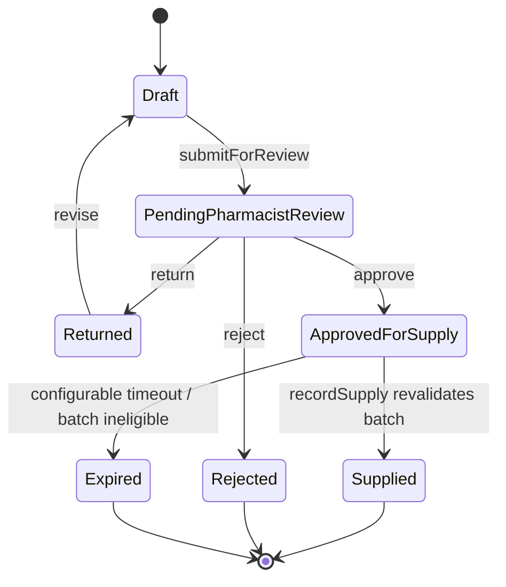

# School Fees Delivery Breakdown and Domain-Pack API Contracts

**Author:** Manus AI  
**Date:** 27 August 2026  
**Status:** Design specification. No described endpoint is active and the Pharmacy page is a non-operational interface prototype only.

## 1. School Fees Pack: 25–34 person-week delivery breakdown

The estimate assumes that Control Ledger’s existing tenancy, branch scope, exact-money arithmetic, payment-evidence handling, reconciliation, append-only audit events, exceptions, independent approval, and ledger foundations are reused. It covers a complete **fee collection** module, not a full school-information system. Academic operations such as timetables, assessments, grading, transcripts, and safeguarding case management are intentionally excluded.

| Work package | Frontend tasks | Backend and data tasks | QA, implementation, and acceptance tasks | Indicative effort |
| --- | --- | --- | --- | ---: |
| Discovery and policy configuration | Fee-rule workshop screens; campus/term configuration prototype; migration review interface | Policy vocabulary; fee calendar and configuration model; data-mapping templates | Rule walkthroughs with bursar and leadership; migration sampling; decision log | 2–3 person-weeks |
| Learner, guardian, and enrolment context | Responsive learner profile; guardian/payer relationship view; active/inactive enrolment state | Additive learner, guardian, relationship, enrolment, campus/class/term tables; branch/school scope checks | Relationship validation, permissions matrix, privacy/access tests | 3–4 person-weeks |
| Fee policies, discounts, and invoices | Fee schedule editor; invoice preview; instalment-plan and concession proposal flows | Versioned fee policy, component, policy-assignment, scholarship/discount, invoice and invoice-line services; exact minor-unit totals | Date/effective-policy tests; total/rounding tests; approval and rollback/reversal tests | 4–5 person-weeks |
| Payment capture and allocation | Cashier and payment-evidence capture; allocation review; receipt screen; unmatched-payment queue | Payment reference, allocation, unapplied credit, correction/reversal, receipt-number, and reconciliation integration; payment provider adapter boundary | Duplicate reference/idempotency tests; split allocation; partial/overpayment; controlled correction tests | 4–5 person-weeks |
| Refunds, waivers, write-offs, and accounting | Proposal and independent-decision screens; decision history; ledger export views | Approval policy hooks, refund/waiver/write-off records, journal-consequence mapping, exact balance derivation | Segregation-of-duties tests; accounting acceptance with finance lead; audit-trail review | 3–4 person-weeks |
| Parent and operations experience | Parent statement, receipt retrieval, arrears worklist, payment instruction and communication preference views | Scoped statement projection, notification adapter interface, contact preference and retention controls | Accessibility/mobile testing; plain-language receipt/statement review; communication opt-out tests | 3–4 person-weeks |
| Reporting and rollout | Collection, aged-debt, fee-income, and concession exposure dashboards; CSV/PDF export controls | Reporting projections and query constraints; export models; archival configuration | Report reconciliation against a controlled source sample; performance/authorisation tests | 2–3 person-weeks |
| Quality hardening, migration, and pilot | Inline recovery states, empty states, user guidance, role-specific pilot checklists | Backfill/import runner with dry-run report; monitoring/audit queries; cutover configuration | Unit/integration/regression suite; test migration rehearsals; mobile acceptance; training and pilot support | 4–6 person-weeks |
| **Total** |  |  |  | **25–34 person-weeks** |

### Staffing translation

| Team shape | Approximate calendar duration | Conditions |
| --- | ---: | --- |
| Product/technical lead, two full-stack engineers, and QA/implementation lead | 10–14 weeks | One school group, one payment channel, prompt decisions, usable source data |
| One full-stack engineer with part-time review support | 25–34 weeks | Same scope, sequential work, no major legacy-data issue |
| Multi-campus group, several payment providers, poor legacy data, or parent mobile app | Add 6–16+ weeks | Scope must be decomposed into separate releases |

## 2. Contract principles for industry packs

The product should use **tRPC procedures as the typed application interface**, because the deployed stack already uses tRPC end-to-end. These are logical endpoint names and request/response contracts; they are not REST URLs and none is activated by this design document.

Every mutation must include `organisationId`, `branchId` where applicable, and an `idempotencyKey`. The server resolves membership and permissions from the authenticated user, generates a correlation identifier, uses exact money strings in minor units, writes the material record and audit event in one transaction, and refuses cross-organisation or cross-branch references. Domain packs may call shared application services but must not write another pack’s tables directly.

| Cross-cutting requirement | Contract rule |
| --- | --- |
| Scope | Input scope is an assertion to validate, never a replacement for authenticated membership checks. |
| Money | Amounts use decimal-safe integer strings such as `"2999778"` for minor units; no floating-point arithmetic. |
| Auditability | Every material mutation produces an append-only event with actor, timestamp, correlation ID, source type, and policy version where relevant. |
| Idempotency | Replayed mutation keys return the prior material outcome rather than duplicating a payment, invoice, stock event, or decision. |
| Authority | Approval, pharmacist review, posting, and controlled corrections are separate procedures with explicit role/policy checks. |
| Files | Requests use managed storage metadata and authorised retrieval only; no file bytes, permanent storage URLs, or storage keys are returned to untrusted clients. |

## 3. Shared Control Ledger core contracts

| Procedure | Input summary | Response summary | Control boundary |
| --- | --- | --- | --- |
| `core.scope.getActive` | `{ organisationId, branchId }` | Authorised organisation, branch, membership role, enabled domain packs | Read only; fail closed if membership is absent. |
| `core.parties.upsert` | Scoped party identity, classification, minimally necessary contacts, `idempotencyKey` | Party identifier and version | Pack-specific data stays in pack-owned profile tables. |
| `core.evidence.createMetadata` | Scoped source reference, filename, MIME, checksum, size, `idempotencyKey` | Attachment metadata and short-lived authorised upload/view step | Bytes are never stored in the database. |
| `core.obligations.issue` | Scoped party, line items, exact minor-unit amount, due date, domain source reference, `idempotencyKey` | Obligation and immutable issuance event | Only a domain service with the relevant policy may invoke it. |
| `core.payments.record` | Payment source/reference, amount, currency, payer, received time, evidence reference, `idempotencyKey` | Observation and reconciliation candidate | Recording does not silently allocate or settle an obligation. |
| `core.allocations.propose` | Payment, eligible obligations, exact allocations, rationale | Proposed allocation or exception | Rules remain domain-owned; confirmation is separately governed. |
| `core.approvals.submit` | Object type/id, decision type, rationale/evidence, policy reference, `idempotencyKey` | Pending approval request | Submitter cannot finalise their own request. |
| `core.approvals.decide` | Approval request, approve/reject/return, decision note, `idempotencyKey` | Append-only decision outcome | Enforces independent decision and terminal-state race protection. |
| `core.exceptions.open` | Scoped source object, category, impact, accountable owner, due date, note | Exception case identifier | Opening a case does not correct stock, money, or clinical data. |
| `core.ledger.prepare` | Source object/version, balanced journal lines, accounting period, `idempotencyKey` | Ready journal proposal | Preparation is separate from independent posting. |
| `core.ledger.post` | Journal identifier, posting decision, `idempotencyKey` | Posted journal event | Independent posting/period rules apply. |

## 4. Pharmacy Pack contracts: future implementation

> **Safety boundary:** These interfaces are proposed only. A production Pharmacy Pack requires pharmacist-led rule design, regulatory review, privacy impact assessment, and operational validation. The current UI prototype exposes no mutation or dispense control.

| Procedure | Input summary | Response summary | Mandatory server-side controls |
| --- | --- | --- | --- |
| `pharmacy.catalogue.createMedicine` | Scoped product attributes, pack/unit conversion, storage category, policy tags, `idempotencyKey` | Versioned medicine record | Authorised catalogue role; effective-date/version checks; no clinical recommendation. |
| `pharmacy.batches.receive` | Medicine, supplier receipt reference, batch/lot, expiry, quantity, storage evidence, `idempotencyKey` | Batch record plus append-only stock receipt | Valid scope, batch uniqueness, exact quantity, approval threshold, audit event. |
| `pharmacy.batches.listEligible` | Scope, medicine, requested quantity, proposed supply date | Read-only eligible candidate batches and rule explanations | Excludes quarantined, expired, recalled, or insufficient batches; no reservation or dispense. |
| `pharmacy.dispensing.createDraft` | Minimal permitted recipient/source-order reference, medicine lines, intended branch, `idempotencyKey` | Draft dispensing request | No stock movement, no financial posting, no clinical decision. |
| `pharmacy.dispensing.submitForReview` | Draft ID, proposed batch lines, evidence references, `idempotencyKey` | Pending pharmacist-review request | Batch eligibility recalculated on server; requester cannot review own request where policy requires separation. |
| `pharmacy.dispensing.decideReview` | Request ID, `approve` / `reject` / `return`, pharmacist decision note, `idempotencyKey` | Immutable review decision | Licensed/authorised pharmacist role; no AI decision; no stock movement merely from approval. |
| `pharmacy.dispensing.recordSupply` | Approved request ID, confirmed batch quantities, required evidence, `idempotencyKey` | Atomic supply event, batch stock-out, domain audit event, downstream finance proposal if configured | Requires approved review, revalidates batch state and quantity inside one transaction, prevents replay/double supply. |
| `pharmacy.quarantine.create` | Batch, cause, source evidence, `idempotencyKey` | Quarantine event | Immediately blocks future eligibility; no destructive stock edit. |
| `pharmacy.recall.initiate` | Supplier/manufacturer recall reference, batch selection, notice evidence, `idempotencyKey` | Recall campaign and affected-batch cases | Quarantine affected batches, trace linked supply events, require governed closure. |
| `pharmacy.controlledMedicines.record` | Configured controlled-medicine receipt/supply/adjustment, witnesses where policy requires, `idempotencyKey` | Append-only controlled-medicine register event | Separate privileges, immutable balance derivation, heightened audit and reporting. |

### Pharmacy state transition

## 5. School Fees Pack contracts: future implementation

| Procedure | Input summary | Response summary | Mandatory server-side controls |
| --- | --- | --- | --- |
| `school.people.upsertLearner` | School/campus scope, learner attributes, permitted guardian relationships, `idempotencyKey` | Learner profile version | Minimum necessary data, guardian relationship validation, privacy-aware role scope. |
| `school.enrolments.record` | Learner, academic year, term, class/campus, status, `idempotencyKey` | Enrolment record | One active enrolment per configured period; append-only status history. |
| `school.feePolicies.create` | Versioned schedule, components, eligibility, effective dates, approval policy, `idempotencyKey` | Draft fee policy | Cannot overwrite an active historical policy. |
| `school.feePolicies.activate` | Fee policy ID, decision evidence, `idempotencyKey` | Active policy version | Independent approval where configured; overlap protection. |
| `school.invoices.issue` | Enrolment, fee policy version, instalment plan, due dates, `idempotencyKey` | Invoice lines and linked `core.obligations.issue` outcome | Exact money, source-policy snapshot, no silent change to issued invoice. |
| `school.payments.record` | Payer, payment channel/reference, amount, evidence metadata, `idempotencyKey` | Linked `core.payments.record` outcome | Does not assume invoice allocation from a reference alone. |
| `school.allocations.confirm` | Payment observation, invoice line allocations, rationale, `idempotencyKey` | Allocation event and receipt projection | Totals cannot exceed unallocated payment/invoice balance; controlled correction path. |
| `school.concessions.propose` | Invoice/fee item, type (discount/scholarship/waiver), policy basis, `idempotencyKey` | Pending core approval request | Proposer cannot decide; policy and budget limit checks. |
| `school.refunds.propose` | Available credit/payment, amount, verified destination evidence, rationale, `idempotencyKey` | Pending core approval request | Separate review, anti-duplicate controls, finance/ledger mapping. |
| `school.statements.get` | Scope, learner or guardian, period, authorised viewer context | Read-only account statement/receipt metadata | Parent/guardian access is relationship-scoped; staff access is role/campus-scoped. |
| `school.arrears.list` | Scope, term/campus/class filters | Read-only aged-debt worklist | No disclosure outside permitted campus/role. |

## 6. Implementation sequence

| Release | Deliverable | Data-writing status |
| --- | --- | --- |
| 0 | Current Pharmacy screen: interface-only prototype and API design | **No pharmacy mutation exists** |
| 1 | Shared pack registry, policy capability checks, typed core-service adapter, domain audit envelope | New technical metadata only after schema review/migration |
| 2 | School context, fee policies, invoices, payments, allocations, statements, controlled financial decisions | Governed school financial writes after test and pilot approval |
| 3 | Pharmacy non-clinical stock: medicine master, supplier receipt, batch, expiry, quarantine, recall | Governed stock records after pharmacist-led validation |
| 4 | Pharmacy dispensing and controlled-medicine workflows | Only after clinical/regulatory, security, and real-device acceptance gates are satisfied |

## References

[1]: https://pcn.gov.ng/wp-content/uploads/2024/09/Pharmacy-Council-of-Nigeria-Act-2022-publication.pdf "Pharmacy Council of Nigeria (Establishment) Act, 2022"

[2]: https://www.dlapiperdataprotection.com/index.html?t=law&c=NG "Data protection laws in Nigeria — NDPA 2023 and GAID 2025 summary"
